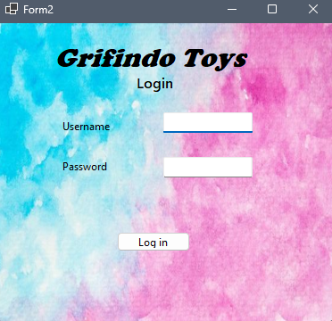
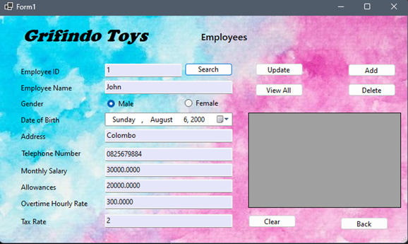
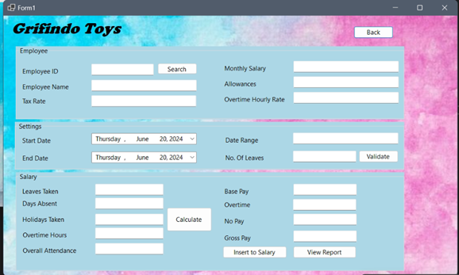

# Grifindo Toys Payroll Management System

A simple yet efficient **Payroll Management System** built with **C#.NET (Windows Forms)** for **Grifindo Toys**, a small-scale toy manufacturing company in the UK with 50 employees. The system is designed to automate salary calculations, manage employee data, and generate payroll reports with accuracy and ease.

---

## 📌 Features

### 1. Employee Component

* Register employee details (name, monthly salary, overtime rate, allowances, etc.)
* Update and delete employee records
* Search and view individual employee details
* View all employee details in a structured list

### 2. Salary Component

* Input salary cycle (begin date & end date) to calculate monthly salaries
* Enter employee leaves, absent days, holidays, and overtime hours
* Automatic calculation of:

  * **No-pay value** → `(Total_Salary / Salary_Cycle_Days) * Absent_Days`
  * **Base Pay value** → `Monthly_Salary + Allowances + (Overtime_Rate * Overtime_Hours)`
  * **Gross Pay** → `Base_Pay – (No-pay + Base_Pay * Government_Tax_Rate)`
* Generate reports:

  * Monthly salary report (per employee)
  * Salary summary for multiple months
  * No-pay, base-pay, and gross-pay reports

### 3. Settings Component

* Configure payroll parameters:

  * Salary cycle duration (e.g., 30 days)
  * Salary cycle start & end dates
  * Maximum annual leave days per employee

---

## 🛠️ Tech Stack

* **Language**: C#
* **Framework**: .NET (Windows Forms)
* **Database**: Microsoft SQL Server
* **IDE**: Visual Studio

---

## 📂 Project Structure

```
GrifindoToysPayroll/
│── Forms/                  # Windows Forms UI  
│── Database/               # SQL Scripts and schema  
│── Models/                 # Employee, Salary, Settings models  
│── Reports/                # Salary and payroll reports  
│── README.md               # Documentation  
```

---

## 🚀 Getting Started

### Prerequisites

* Visual Studio (2019 or later)
* .NET Framework 4.7+
* Microsoft SQL Server

### Installation

1. Clone the repository:

   ```bash
   git clone https://github.com/yourusername/GrifindoToysPayroll.git
   ```
2. Open the solution in **Visual Studio**
3. Configure the database connection string in `App.config`
4. Run the database script from `/Database/schema.sql`
5. Build and run the project

---

## 📸 Screenshots

### Login Page



### Employee Management



### Salary Calculation



### Reports


---

## 📊 Database Schema

**Employees Table**

* EmployeeID (PK)
* Name
* MonthlySalary
* OvertimeRate
* Allowances

**Salaries Table**

* SalaryID (PK)
* EmployeeID (FK)
* BasePay
* NoPay
* GrossPay
* DateRange

**Settings Table**

* SettingID (PK)
* SalaryCycleStart
* SalaryCycleEnd
* AnnualLeaveDays

---

## 🔮 Future Improvements

* Role-based authentication (Admin/HR)
* Export reports to PDF/Excel
* Attendance integration with biometric system
* Cloud-based version

---

## 📄 License

This project is licensed under the **MIT License** – feel free to use and modify.

---
